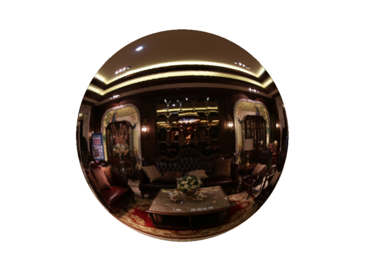
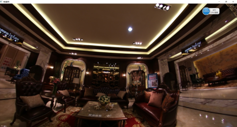
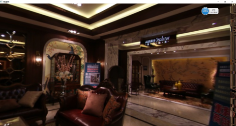

### 2021/11/08
用python写了双鱼眼拼接: https://mianbaoduo.com/o/bread/YZyZlJY=
### 2017/3/30更新
   
  这个程序还非常不完善：后面有时间还想补充的功能：最近几个月会移植到ubuntu加opencv.
 上班狗，累成狗，争取抽空完善 
### 鱼眼矫正
　(vs2012+opengl)：自己将opengl安装好就行了

参考：[雷霄骅OPENGL博客]: http://blog.csdn.net/leixiaohua1020/article/details/40379845

在这里用到了一种新的语言：OpenGL Shader Language,简称GLSL。它是一种类似于C语言的专门为GPU设计的语言，它可以放在GPU里面被并行运行。
OpenGL的着色器有.frag和.vert两个文件。这两个文件在被编译和链接后就可以产生可执行程序与GPU交互。
.vert 是Vertex Shader（顶点着色器），用于顶点计算，可以理解控制顶点的位置，在这个文件中我们通常会传入当前顶点的位置，和纹理的坐标。
.frag 是Fragment Shader（片元着色器）．

#### 1.说明
Input:处理YUV420P流媒体，
output：球形渲染
####2.用法
> 最开始想用opencv来直接一部到位解码，读取rgb,一是想先看看效果,二是公司安卓好像不支持opencv来解码封装视频．
> 所以直接读取yuv420视频不用解码［这里可以用video_eye软件来解码生成yuv文件］．
```
#define LOAD_RGB24   0
#define LOAD_BGR24   0
#define LOAD_BGRA    0
#define LOAD_YUV420P 1          //读取的格式选择，
const int pixel_w = 1440, pixel_h =1080 ;   //视频的分辨率
```

注意设置：分辨率，否则会导致转换rgb错误．
####3.原理
　　- 这里的原理很简单，根据r=2f/sin(theta/2）把二维的图片铺在三维空间上．

#### ４.缺点
A:缺少相机标定，默认视角180°（市面上的鱼眼摄像头一般也是180，r=2f/sin(theta/2),f是焦距，r是像素图片中心的距离）。
B:对于输入的每帧图片缺少边缘检测,边缘有黑框会影响效果。（一般不会有黑框对于h.264解码后的视频）
C:gluBuild2DMipmaps只能处理 宽高为偶数的图像（前面加一个判断条件）
#### 3.跑了一下摄像头的视频




